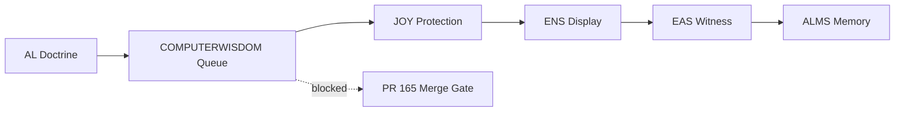

# ALMS Replay Visualization V0.1

Status: QUEUED_MEMORY
Authority: false
Membrane: HOLDS

## Purpose

Visualize the replay spine without activating runtime or claiming merge.

## Spine

AL -> COMPUTERWISDOM -> JOY -> ENS -> EAS -> ALMS

## Layer Status

- AL: STORED
- COMPUTERWISDOM: BLOCKED_BY_RULE_REFERENCE
- JOY: ACTIVE_PROTECTION
- ENS: DISPLAY_ONLY
- EAS: CLAIM_WITNESS_ONLY
- ALMS: QUEUED_MEMORY

## Mermaid

## Invariants

- Authority remains false.
- Membrane remains HOLDS.
- Replay is not judgment.
- Display is not authority.
- Witnessing is not truth.
- Memory is allowed before merge.
- Promotion requires receipt.

Final line: The spine can be visualized before it is activated.
